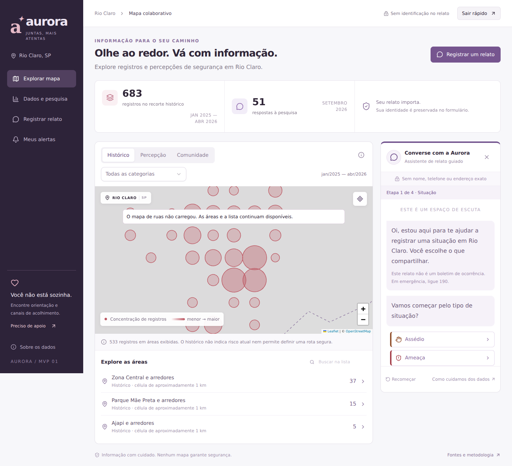
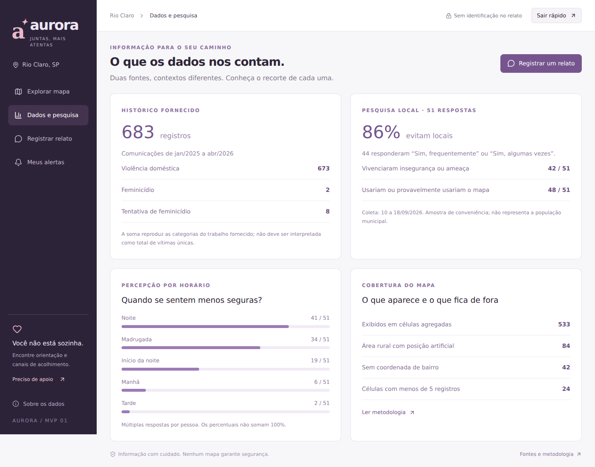
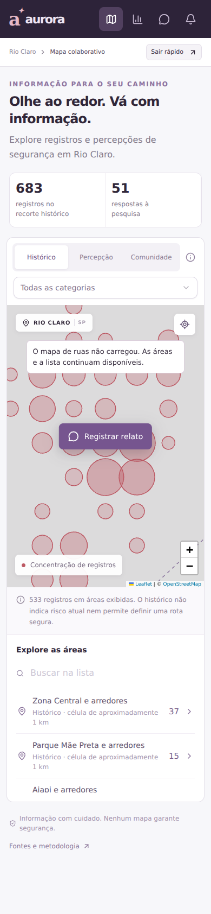
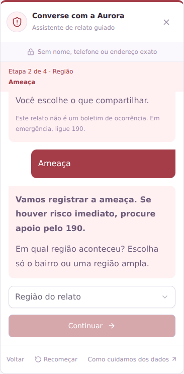
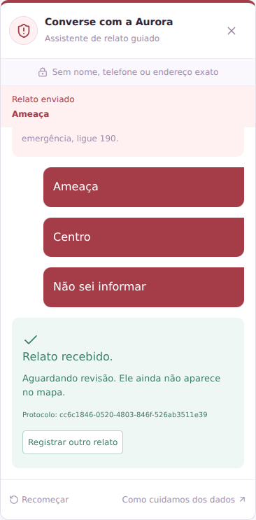

# Aurora — MVP 02

Aplicação web voltada à consulta de informações sobre segurança das mulheres em Rio Claro e ao registro anônimo de relatos comunitários.

O Aurora reúne um mapa interativo, dados históricos agregados, resultados de uma pesquisa de percepção e um chatbot guiado para registrar relatos sem solicitar nome, telefone ou endereço exato.

## Novidades do MVP 02

- Limite de zoom entre 11 e 16 para evitar que o usuário se perca no mapa.
- Navegação limitada à região de Rio Claro.
- Interface adaptada para celular e tablet.
- Botão fixo para registrar um relato no celular.
- Chatbot reorganizado em quatro etapas: situação, região, período e revisão.
- Possibilidade de voltar e corrigir uma resposta antes do envio.
- Validação do mês, consentimento e opções selecionadas.
- Cores, ícones e mensagens diferentes para cada tipo de relato.
- Envio de relatos com protocolo de acompanhamento.
- Proteção contra envios duplicados e falhas em requisições simultâneas.
- Tela de confirmação após o envio do relato.

## Prévia visual

### Mapa no desktop



### Dados e pesquisa



### Versão mobile



### Chatbot com diferentes tipos de relato

| Falta de iluminação                                                  | Ameaça                                                       |
| -------------------------------------------------------------------- | ------------------------------------------------------------ |
|  |  |

### Confirmação de envio



> As capturas mostram a interface em diferentes tamanhos de tela. O fundo de ruas pode aparecer indisponível quando o serviço externo de mapas não responde, mas os dados agregados e os controles do Aurora continuam funcionando.

## Funcionalidades

### Mapa interativo

- Camada de registros históricos.
- Camada de percepção de segurança.
- Camada de relatos da comunidade.
- Filtro por categoria.
- Busca de áreas pelo nome.
- Limite de zoom e de navegação.
- Áreas representadas de forma agregada e aproximada.
- Botão para recentralizar o mapa em Rio Claro.

### Chatbot de relatos

O chatbot utiliza perguntas predefinidas para orientar o registro:

1. Tipo de situação.
2. Região ampla onde aconteceu.
3. Período do dia.
4. Mês da situação e confirmação do envio.

O sistema não solicita texto livre, nome, contato ou endereço exato. Os relatos ficam pendentes de revisão e não são publicados automaticamente no mapa.

### Alertas de proximidade

O usuário pode autorizar a localização do navegador para receber um aviso quando estiver próximo de uma área histórica exibida.

A localização é processada no navegador. O recurso funciona enquanto a página está aberta e não garante uma rota segura nem confirma que existe perigo acontecendo naquele momento.

## Dados utilizados

- 683 registros históricos no recorte analisado.
- 673 registros de violência doméstica.
- 2 registros de feminicídio.
- 8 registros de tentativa de feminicídio.
- 51 respostas na pesquisa de percepção.
- Dados exibidos de forma agregada para preservar a privacidade.

Os pontos do mapa representam áreas aproximadas. Eles não correspondem a endereços individuais nem permitem identificar uma rua específica.

## Tecnologias

- Next.js
- React
- TypeScript
- Leaflet
- OpenStreetMap
- CSS responsivo
- API Route do Next.js
- Armazenamento local de relatos em arquivos JSON

## Como executar

Requisitos:

- Node.js 22 ou superior.

Instalação:

```bash
npm install
```

Executar em desenvolvimento:

```bash
npm run dev
```

Depois, acesse:

```text
http://localhost:3000
```

Para testar pelo celular na mesma rede:

```bash
npm run dev -- --hostname 0.0.0.0
```

Depois, abra no celular:

```text
http://IP-DO-COMPUTADOR:3000
```

A geolocalização pode exigir HTTPS quando o acesso não for feito pelo `localhost`.

## Validação

Compilar o projeto:

```bash
npm run build
```

Executar o teste da API de relatos:

```bash
node scripts/test-reports.mjs
```

O teste verifica validação de dados, consentimento, mês, origem da requisição, limite de tamanho, envios simultâneos e reenvio idempotente.

## Limitações do MVP 02

- O chatbot é guiado por opções e não utiliza inteligência artificial generativa.
- Relatos não são publicados automaticamente.
- Não existe equipe de moderação integrada ao sistema.
- O armazenamento local depende de um servidor com disco gravável e persistente.
- O mapa não garante segurança e não substitui canais oficiais de emergência.
- Em situações de risco imediato, ligue 190.
- Para orientação e atendimento à mulher, ligue 180.

## Fontes

- OpenStreetMap: https://www.openstreetmap.org/copyright
- Política de uso dos tiles: https://operations.osmfoundation.org/policies/tiles/
- Ligue 180: https://www.gov.br/mulheres/pt-br/ligue180
